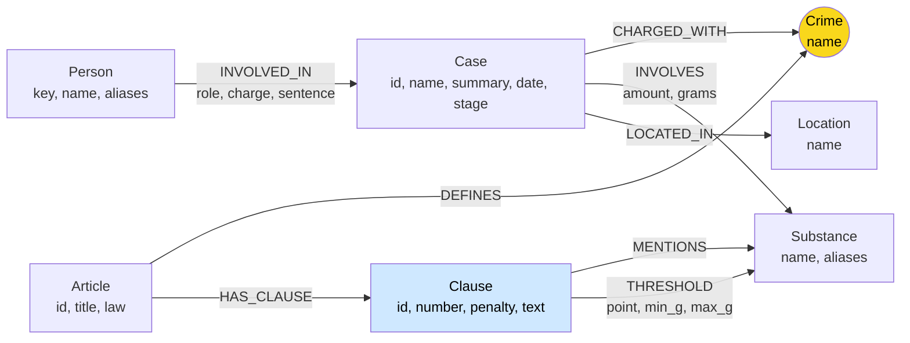

# Thiết kế Ontology — Day 19

**Họ tên:** Nguyễn Đức Thắng  **MSSV:** 2A202602605

**Lựa chọn** (đánh dấu một):
- [ ] Dùng ontology gợi ý (có thể chỉnh nhỏ)
- [x] Tự thiết kế (xét bonus +15, xem `SUBMISSION.md`)

> Hướng dẫn: `LAB_GUIDE.md` Bước 2. Dùng ontology gợi ý thì vẫn phải điền đủ các mục dưới đây bằng lời của bạn.

Ý tưởng: giữ `Crime` làm cầu nối (vì tội danh là thứ duy nhất cả luật lẫn báo đều gọi tên), nhưng sửa 4 chỗ mà khi đọc dữ liệu thấy ontology gợi ý sẽ gãy:
khóa `Case`/`Person` không ổn định, tên chất đồng nghĩa (`thuốc lắc`, `kẹo` = MDMA), ngưỡng khối lượng không được mô hình hóa nên không chọn được đúng khoản, và không phân biệt giai đoạn tố tụng.

## 1. Sơ đồ

- **Node cầu nối:** `Crime` (vàng). Phía luật: `Article -DEFINES-> Crime`. Phía tin: `Case -CHARGED_WITH-> Crime`.
- **Cầu nối phụ:** `Substance`. Phía luật: `Clause -THRESHOLD/MENTIONS-> Substance`. Phía tin: `Case -INVOLVES-> Substance`. Cầu này dùng để chọn **khoản**, không dùng để chọn Điều.
- Phần mới so với gợi ý: cạnh `THRESHOLD`, `INVOLVES.grams`, `Case.id`/`Case.stage`, `Person.key`, `Substance.aliases`.

## 2. Entity types (node labels)

| Label | Ý nghĩa | Khóa định danh (`MERGE` theo) | Properties | Lấy từ KB nào | Trích bằng (regex / LLM / khác) |
| --- | --- | --- | --- | --- | --- |
| `Article` | Một Điều luật | `id` = metadata `article`, ví dụ `"Điều 251 BLHS"` | `title`, `law`, `doc_id` | Luật | Front matter + regex |
| `Clause` | Một khoản của Điều | `id` = `"Điều 251 BLHS khoản 4"` | `number`, `penalty` (khung hình phạt ở dòng đầu khoản), `text`, `doc_id` | Luật | Regex `^(\d+)\.\s` tách khoản; regex `bị (phạt…\|tù…)` lấy khung |
| `Crime` | Tội danh chuẩn (**cầu nối**) | `name` = `normalize_crime(tiêu đề Điều)`, ví dụ `"mua bán trái phép chất ma túy"` | `name` | Luật định nghĩa; tin chỉ được **nối vào**, không tạo mới | Regex tiêu đề `Điều N. Tội …`. Tội danh từ tin đi qua `link_entity`, không khớp thì bỏ |
| `Substance` | Chất ma túy, tên chuẩn | `name` chuẩn (`MDMA`, `Methamphetamine`, `Ketamine`, `Etomidate`…) | `aliases` (`thuốc lắc`, `kẹo` → MDMA; `ma túy đá` → Methamphetamine; `heroin` → Heroine; `pod chill` → Etomidate) | Cả hai | Luật: so chuỗi với danh sách chuẩn. Tin: LLM, rồi map qua bảng alias + `link_entity` |
| `Case` | Một vụ việc **trong một bài báo** | `id` = `"<doc_id>#<thứ tự vụ trong bài>"`, ví dụ `"news-100260918080821054#0"` | `name`, `summary`, `date`, `stage` (`bắt giữ` / `khởi tố` / `truy tố` / `xét xử sơ thẩm` / `xét xử phúc thẩm` / `khác`), `doc_id` | Tin | LLM (JSON mode) |
| `Person` | Người trong vụ việc, dùng chung giữa các bài | `key` = họ tên đã chuẩn hóa (NFC, chữ thường, gộp khoảng trắng) | `name` (cách viết đầu tiên gặp), `aliases` (biệt danh, ví dụ `Hoàng Nato`) | Tin | LLM + chuẩn hóa trong code |
| `Location` | Tỉnh/thành nơi xảy ra vụ | `name` | | Tin | LLM |

`Crime`, `Substance`, `Person`, `Location` **không có `doc_id`** vì là node dùng chung giữa nhiều tài liệu. Mọi node sinh ra từ đúng một tài liệu (`Article`, `Clause`, `Case`) có `doc_id = Document.id` theo hợp đồng.

## 3. Relationships

| Type | Từ → Đến | Properties trên cạnh | Ý nghĩa |
| --- | --- | --- | --- |
| `DEFINES` | `Article` → `Crime` | | Điều luật định nghĩa tội danh (chỉ Điều có tiêu đề `Tội …`; Luật PCMT không có) |
| `HAS_CLAUSE` | `Article` → `Clause` | | Điều gồm các khoản |
| `MENTIONS` | `Clause` → `Substance` | | Khoản có nhắc tên chất (định tính, kể cả khi không kèm khối lượng) |
| `THRESHOLD` | `Clause` → `Substance` | `point` (điểm `a`, `b`…), `min_g`, `max_g` (gam; `max_g = null` nghĩa là "trở lên") | Khoản áp dụng cho chất này khi khối lượng nằm trong `[min_g, max_g)`. Đổi kilôgam ra gam khi parse |
| `CHARGED_WITH` | `Case` → `Crime` | | Vụ việc bị điều tra/truy tố/xét xử về tội này (hợp của tội danh cấp vụ và tội danh từng người) |
| `INVOLVES` | `Case` → `Substance` | `amount` (nguyên văn, ví dụ `"hơn 9,6kg"`), `grams` (số, parse trong code, `null` nếu là "5 viên") | Vụ việc liên quan chất này |
| `LOCATED_IN` | `Case` → `Location` | | Nơi xảy ra |
| `INVOLVED_IN` | `Person` → `Case` | `role` (`bị cáo` / `bị can` / `nghi phạm` / `người liên quan` / `cán bộ`), `charge`, `sentence` | Vai trò, tội danh và mức án **của riêng người này** trong vụ |

Mức án là **property của cạnh** `INVOLVED_IN`, không phải node: mức án chỉ có nghĩa khi gắn với một người trong một vụ, và không ai cần truy vấn "mọi vụ có mức án 36 tháng".

## 4. Node cầu nối giữa 2 KB

- **Node nào:** `Crime`.
- **Vì sao chọn node này:** đây là khái niệm duy nhất hai KB cùng gọi tên. Luật định nghĩa tội trong tiêu đề Điều, báo viết "về tội mua bán trái phép chất ma túy". Người, địa điểm, ngày tháng chỉ có ở tin; khoản, khung hình phạt chỉ có ở luật. `Substance` cũng có ở cả hai, nhưng một chất (MDMA) xuất hiện trong 5 Điều khác nhau (248–252), nên không dùng được để chọn Điều. Nó chỉ dùng được để chọn **khoản** sau khi đã biết Điều qua `Crime`.
- **Cách đảm bảo hai phía khớp tên:**
  1. `Crime` chỉ được tạo từ phía luật. Phía tin chỉ `MATCH`/nối vào tên đã có, nên không thể sinh ra node `Crime` "mồ côi" với tên lệch.
  2. Prompt trích xuất đưa **nguyên văn danh sách 13 tội danh chuẩn** và yêu cầu chọn đúng chuỗi.
  3. Kết quả LLM vẫn đi qua `link_entity` (`src/graph.py`), gồm 4 tầng: khớp chính xác sau `normalize_crime` (bỏ "Tội", chữ thường) → khớp sau khi bỏ dấu thanh (`ma tuý`/`ma túy`) → `difflib` cutoff 0.8 → **chặn khái niệm rộng hơn**: nếu cụm từ trong tin nằm trọn, nguyên từ, bên trong một tên dài hơn thì trả `None`.
     Tầng cuối đến từ một lỗi thật. Với `cutoff=0.8`, `"sử dụng trái phép chất ma túy"` (vi phạm hành chính, **không** phải tội trong BLHS; 126 người trong chuyên án "Hoàng Nato" bị xử lý vì việc này) khớp nhầm sang `"tổ chức sử dụng trái phép chất ma túy"` (Điều 255) với ratio 0.879. Sau khi chặn thì trả `None`. `"mua bán trái phép ma túy"` (báo bỏ chữ "chất") vẫn nối đúng sang Điều 251.
- **Khi nào cầu gãy, và bạn xử lý thế nào:**
  - *Báo không nêu tội danh*, chỉ tả hành vi ("bắt quả tang", "thu giữ"), hoặc vụ ở giai đoạn bắt giữ chưa khởi tố. Xử lý: `CHARGED_WITH` lấy **hợp** của `charges` cấp vụ và `charge` của từng người, nên chỉ cần một trong hai có là cầu không gãy. Bài không có vụ cụ thể (tuyên truyền, hội nghị) thì không có `Case`, gãy là đúng.
  - *Tội ngoài Chương XX*, ví dụ "lừa đảo", "đưa hối lộ" trong vụ Viện Pháp y tâm thần, hay Điều 16 BLHS mà bị cáo viện dẫn. KB luật không có các Điều này nên `link_entity` trả `None`. Đây là **gãy đúng**: nối sai còn tệ hơn không nối.
  - *Phát hiện:* `MATCH (k:Case) WHERE NOT (k)-[:CHARGED_WITH]->() RETURN k.id, k.name` (nhóm lỗi E1), rồi mở bài gốc theo `doc_id` để phân loại "nên nối" hay "gãy đúng".

## 5. Competency questions

| Câu | Đường đi (Cypher pattern) | Trả lời được? |
| --- | --- | --- |
| Q1 | `(:Article {id:'Điều 2 Luật PCMT'})-[:HAS_CLAUSE]->(:Clause {number:4})`, `text` chứa định nghĩa "tiền chất" | **Có, nhưng graph gần như không thêm gì.** Câu single-hop, đáp án nằm nguyên trong một đoạn văn bản, vector search lấy được chunk đó. Luật PCMT không có `Crime` nên không có đường đa bước. Chấp nhận: Flat RAG đủ cho loại câu này |
| Q2 | `(k:Case {doc_id:'news-100260928173914514'})<-[r:INVOLVED_IN]-(p:Person) WHERE r.sentence CONTAINS 'tử hình' RETURN p.name` | **Có.** Mức án nằm trên cạnh nên lọc được trực tiếp. Seed là `Case` có `doc_id` trong kết quả vector search |
| Q3 | `(:Person {key:'lê minh thành'})-[r:INVOLVED_IN]->(:Case)-[:CHARGED_WITH]->(:Crime)<-[:DEFINES]-(a:Article)-[:HAS_CLAUSE]->(:Clause {number:1})` → `r.sentence` ("36 tháng tù"), `a.id` ("Điều 251 BLHS"), `penalty` ("phạt tù từ 02 năm đến 07 năm") | **Có.** Seed `Person` nhờ tên xuất hiện trong câu hỏi |
| Q4 | `(p:Person)-[:INVOLVED_IN]->(:Case)-[:CHARGED_WITH]->(:Crime)<-[:DEFINES]-(a:Article)-[:HAS_CLAUSE]->(cl:Clause) WHERE 'Hoàng Nato' IN p.aliases AND cl.penalty CONTAINS 'tù' RETURN a.id, cl.number, cl.penalty ORDER BY cl.number DESC LIMIT 1` → khoản 4 Điều 255: "tù 20 năm hoặc tù chung thân" | **Có.** Seed nhờ `aliases`. Cần lấy khoản có khung **cao nhất**. Quy tắc lọc của gợi ý (khoản 1 + khoản nhắc chất của vụ) bỏ sót khoản này, vì các khoản của Điều 255 không nhắc chất nào. Rủi ro: vụ ở giai đoạn `bắt giữ`, nếu LLM không điền tội danh thì cầu gãy |
| Q5 | `(:Person {key:'cái quang huy'})-[:INVOLVED_IN]->(k:Case)-[:CHARGED_WITH]->(:Crime)<-[:DEFINES]-(a:Article)-[:HAS_CLAUSE]->(cl:Clause)-[t:THRESHOLD]->(s:Substance)<-[i:INVOLVES]-(k) WHERE i.grams >= t.min_g AND (t.max_g IS NULL OR i.grams < t.max_g)` → MDMA 9600g ≥ 100g → **khoản 4 Điều 250**, "tù 20 năm, tù chung thân hoặc tử hình" | **Có, và là câu ontology gợi ý không làm được.** Gợi ý trả về mọi khoản nhắc MDMA (khoản 1–4) rồi để LLM tự so "9,6kg" với "từ 30 gam đến dưới 100 gam". Ở đây phép so sánh chạy trong Cypher và chỉ trả về đúng một khoản |
| Q6 | `(s:Substance {name:'MDMA'})<-[i:INVOLVES]-(k:Case) RETURN k.name, k.doc_id, i.amount` | **Có, phụ thuộc chất lượng trích xuất.** Seed `Substance` vì "MDMA" có trong câu hỏi. Bảng alias giúp nối vụ Lê Minh Thành (báo gọi viên "kẹo", giám định là MDMA). Vụ Viện Pháp y tâm thần chỉ được tính nếu LLM trích được dòng "thu giữ MDMA, ketamine…" nằm sâu trong bài dài |

## 6. Quyết định thiết kế và đánh đổi

1. **Khóa `Case` = `doc_id#thứ tự`, không phải tên LLM đặt.**
   *Phương án khác:* `MERGE` theo `name` (gợi ý); hoặc gộp các bài cùng một vụ thành một `Case` (vụ "Hoàng Nato" có 4 bài).
   *Vì sao:* tên do LLM đặt đổi mỗi lần chạy ("Vụ mua bán 36kg ma túy" / "Đường dây 36kg ma túy tại TP.HCM"). Hai bài khác nhau có thể bị đặt trùng tên và gộp nhầm, còn cùng một bài chạy 2 lần lại ra 2 node. Khóa theo tài liệu thì ổn định và tái lập được. Còn gộp các bài cùng một vụ thì cần nhận diện sự kiện (event resolution), khó và dễ gộp sai, nên tôi để `Person` dùng chung làm việc này (quyết định 2).
   *Đánh đổi:* một vụ ngoài đời thành nhiều `Case` nếu nhiều bài cùng viết về nó.

2. **`Person` dùng chung giữa các bài, khóa theo họ tên đã chuẩn hóa, kèm `aliases`.**
   *Phương án khác:* `Person` riêng cho từng bài (khóa `doc_id + name`), không bao giờ trùng nhầm nhưng mất liên kết giữa các bài.
   *Vì sao:* đây chính là cầu nối giữa các bài trong KB tin. "Dương Minh Tuấn (Hoàng Nato)" xuất hiện ở 4 bài, "Lê Văn Đông" ở 2 bài Viện Pháp y. Chuẩn hóa NFC + chữ thường để "Lê Minh Thành" và "lê minh thành" gộp làm một. `aliases` giúp tìm được người qua biệt danh trong câu hỏi (Q4).
   *Đánh đổi:* hai người trùng họ tên ở hai bài khác nhau sẽ bị gộp. Với 20 bài thì rủi ro thấp; quy mô lớn hơn thì cần thêm tuổi/quê vào khóa.

3. **Ngưỡng khối lượng là property của cạnh `THRESHOLD {point, min_g, max_g}`, không phải node.**
   *Phương án khác:* (a) không mô hình hóa, để LLM đọc `Clause.text` (gợi ý); (b) node `Point` cho từng điểm a), b)… với node `Threshold` riêng.
   *Vì sao:* ngưỡng chỉ có nghĩa trong cặp (khoản, chất), nên đặt trên cạnh nối đúng cặp đó là tự nhiên nhất. Một hop, so sánh được ngay trong Cypher (`i.grams >= t.min_g`). Phương án (b) graph to hơn khoảng gấp 3 mà câu hỏi không cần điểm làm thực thể. Tên điểm giữ trong `point` để trích dẫn được.
   *Đánh đổi:* phải parse cả khối lượng phía tin ra gam (`"hơn 9,6kg"` → 9600). Đơn vị "viên" không quy đổi được, khi đó `grams = null` và quay về cách của gợi ý (đưa mọi khoản nhắc chất).

4. **Độ chi tiết dừng ở khoản; điểm chỉ là property.** Khoản là đơn vị mang khung hình phạt, đúng thứ câu hỏi cần. Tách tới điểm thì prompt dài thêm mà không có câu hỏi nào cần.

5. **Luật bằng regex, tin bằng LLM; tên chuẩn hóa bằng code chứ không tin LLM.** Văn bản luật rất đều nên regex rẻ, nhanh và cho cùng kết quả mỗi lần chạy (`Article` = 18 và `Crime` = 13 cố định). Tin tức viết tự do nên cần LLM, nhưng mọi tên LLM trả về (tội, chất) đều đi qua `link_entity` / bảng alias trước khi `MERGE`. Danh sách chuẩn trong prompt chỉ là "gợi ý mạnh", không phải bảo đảm.

6. **Giai đoạn tố tụng là property `Case.stage`, không phải chuỗi node sự kiện.** *Phương án khác:* node `Event` (bắt → khởi tố → xét xử → phúc thẩm) nối thành chuỗi. Mỗi bài chỉ tả một thời điểm, nên một property cho mỗi `Case` là đủ để phân biệt "bị bắt về hành vi…" (Q4) với "bị tuyên án" (Q2, Q3). Chuỗi sự kiện chỉ có lợi khi gộp được nhiều bài cùng một vụ, mà quyết định 1 đã không làm việc đó.

## 7. So với ontology gợi ý (bắt buộc nếu xét bonus)

| Điểm khác | Gợi ý làm gì | Bạn làm gì | Vấn đề nó giải quyết | Bằng chứng (Cypher, hoặc số liệu benchmark) |
| --- | --- | --- | --- | --- |
| Ngưỡng khối lượng | Chỉ có `Clause -MENTIONS-> Substance`; LLM tự so khối lượng với chữ trong khoản | Thêm `Clause -THRESHOLD {point, min_g, max_g}-> Substance` và `INVOLVES.grams` | Chọn đúng **một** khoản theo khối lượng (Q5: khoản 4 Điều 250), prompt ngắn hơn | Cypher Q5 trên graph của tôi trả về **1 dòng** `Điều 250 BLHS | 4 | b | MDMA | hơn 9,6kg | phạt tù 20 năm, tù chung thân hoặc tử hình`; quy tắc của gợi ý trả về **4 khoản** (khoản 1–4 Điều 250), xem `report/evidence/hint_graph_queries.txt` (`Q5hint`). Q5 cả hai bên đều 1.00 / 2 (lần chạy này LLM tự so được), nhưng token vào mỗi câu giảm từ 5 589 xuống 2 518. **Mặt trái:** khi LLM gán sai chất, `THRESHOLD` suy ra khoản sai (REPORT_KG.md, E5) |
| Thang khung phạt + tội danh theo người (KG-3, dựa trên `INVOLVED_IN.charge`) | Khoản 1 + khoản `MENTIONS` chất của vụ, theo mọi tội của vụ | Dòng khung phạt của mọi khoản; khi câu hỏi nêu tên người thì chỉ theo tội của người đó | Thiếu khung cao nhất ở các Điều không định lượng theo chất (Điều 255, Q4: E2) | Q4: gợi ý `recall=0.67 judge=1` ("không có thông tin về các khoản nặng hơn") → của tôi `recall=1.00 judge=2` ("tù 20 năm hoặc tù chung thân (theo khoản 4)") |
| Khóa `Case` + prompt bỏ đoạn teaser | `MERGE (k:Case {name})` theo tên LLM đặt; prompt không cảnh báo teaser | `MERGE (k:Case {id: doc_id#i})`; prompt bảo bỏ đoạn giới thiệu bài khác ở cuối | `Case` sai nguồn hoặc trùng (E3); graph không tái lập được giữa các lần chạy | Graph gợi ý: bài `news-100260918080821054` (Lê Minh Thành) có **2** `Case`, trong đó "Vụ vận chuyển ma túy qua sân bay Nội Bài" lấy từ teaser vụ Cái Quang Huy; câu trả lời Q6 của bản gợi ý liệt kê vụ này hai lần dưới hai tên. Graph của tôi: `MATCH (k:Case) RETURN k.doc_id, count(*) ORDER BY count(*) DESC` cho tối đa **1** `Case` mỗi bài. Phần lớn cải thiện này đến từ prompt, không riêng từ khóa |
| Tên chất đồng nghĩa | `Substance {name}` lấy nguyên chữ LLM trả về | Tên chuẩn + `aliases`; map `thuốc lắc`/`kẹo` → MDMA, `ma túy đá` → Methamphetamine, `pod chill` → Etomidate | `Substance` bị tách đôi (E3) làm sót vụ ở câu aggregation (Q6) | **Chưa thấy khác biệt trong lần chạy này:** cả hai graph đều có đúng 11 `Substance` với cùng tên chuẩn (`MATCH (s:Substance) RETURN s.name ORDER BY toLower(s.name)`), vì Gemini đã tự chuẩn hóa khi được đưa danh sách chất. Bảng alias là lớp bảo vệ khi LLM không tuân thủ (đã kiểm bằng unit: `canonical_substance("ma túy đá")` = `Methamphetamine`, `("kẹo")` = `MDMA`) |
| Giai đoạn tố tụng | Không có | `Case.stage` | Phân biệt "bị bắt về hành vi" với "bị tuyên án" | `MATCH (k:Case) RETURN k.stage, count(*)` → bắt giữ 5, xét xử sơ thẩm 3, truy tố 1, xét xử phúc thẩm 1, khởi tố 1, khác 1. Câu trả lời Q4 của tôi: "bị bắt giữ và điều tra về hành vi…" |
| Chặn nối nhầm ở cầu | `link_entity` cutoff 0.8 | Thêm tầng bỏ dấu và tầng chặn "khái niệm rộng hơn" | `"sử dụng trái phép chất ma túy"` không còn bị nối nhầm sang Điều 255 | Trước khi sửa: `link_entity("sử dụng trái phép chất ma túy", crimes)` = `"tổ chức sử dụng trái phép chất ma túy"` (ratio 0.879); sau khi sửa = `None`; `pytest -k LinkEntity` vẫn `5 passed` |
| Khóa `Person` | `MERGE (Person {name})` theo chuỗi thô; `SET aliases =` ghi đè | Khóa `key` chuẩn hóa NFC + chữ thường; `aliases` được gộp | Cùng một người bị tách node; biệt danh của bài trước bị bài sau xóa | Cả hai graph: `Dương Minh Tuấn ['Hoàng Nato']` nối 4 vụ, nên lần chạy này không có khác biệt đo được |

**Tổng benchmark** (cùng provider, mỗi bên chạy một lần): gợi ý `recall 0.94 / judge 1.83 / in_tok 5589`; của tôi `recall 0.89 / judge 2.00 / in_tok 2518`. Chênh lệch recall nằm hoàn toàn ở Q6 (gợi ý 1.00, của tôi 0.33). Ở câu đó câu trả lời của tôi vẫn đủ 3 vụ, judge 2, nhưng gọi vụ bằng tên vụ thay vì tên người nên trượt `must_include` (REPORT_KG.md, E4).

**Competency question gợi ý trả lời thiếu:** Q5 (khoản theo khối lượng), Q4 (khoản khung cao nhất bị quy tắc lọc theo chất loại bỏ). Xem mục 5.

## 8. Hạn chế còn lại

- **Cùng một vụ, nhiều `Case`.** 4 bài về "Hoàng Nato" thành 4 `Case`, chỉ nối với nhau qua `Person`. Câu kiểu "có bao nhiêu vụ…" (aggregation) sẽ đếm thừa.
- **Trùng tên người.** Hai người khác nhau cùng họ tên sẽ bị gộp. Ngược lại, LLM ghi "Thành" thay cho "Lê Minh Thành" thì bị tách.
- **Teaser bài khác ở cuối file.** Dữ liệu crawl dính đoạn mở đầu của bài khác ở cuối, ví dụ bài Lê Minh Thành kết thúc bằng tóm tắt vụ Cái Quang Huy. LLM có thể trích thêm một `Case` sai `doc_id` từ đoạn này. Prompt yêu cầu chỉ lấy vụ chính của bài, nhưng không bảo đảm. Sửa tận gốc phải làm ở bước crawl.
- **Ngưỡng chỉ có cho chất được gọi tên trong luật.** Ketamine, Etomidate thuộc nhóm "các chất ma túy khác ở thể rắn" nhưng chưa được nối vào nhóm đó, nên `THRESHOLD` không áp dụng cho chúng. Một điểm luật nhắc cả "nhựa cần sa" lẫn "lá cần sa" thì `cần sa` nhận hai ngưỡng; phân biệt bằng `point` và `Clause.text`.
- **Đơn vị không quy đổi được** ("5 viên", "1.000 đầu pod chill") cho `grams = null`, không chọn được khoản theo khối lượng.
- **`Location` chưa chuẩn hóa** ("TP.HCM" và "TP Hồ Chí Minh" là hai node). Chấp nhận vì không câu hỏi nào lọc theo địa điểm.
- **Q1 (định nghĩa luật thuần):** graph không giúp gì thêm so với Flat RAG.
- **`THRESHOLD` khuếch đại lỗi gán chất.** Bài Hoàng Nato chỉ viết "100g ma túy tổng hợp các loại", nhưng LLM ghi là `Methamphetamine`. Cypher vì thế kết luận vụ thuộc khoản 4 Điều 251 (tới tử hình). Cần thêm trường `evidence` (câu trích nguyên văn) để kiểm chứng tên chất trước khi tạo `grams` (REPORT_KG.md, E5).
- **`Case.date` bị LLM đoán năm.** Báo chỉ viết "ngày 21-9" nên LLM điền 2024 hoặc 2023, trong khi bài đăng năm 2026. Sửa bằng cách đưa ngày đăng bài (metadata `document_version`) vào prompt.
- **`INVOLVED_IN.charge` rỗng với tội ngoài Chương XX** (đưa/nhận hối lộ trong vụ Viện Pháp y). Rỗng là đúng theo thiết kế "không nối bừa", nhưng làm mất thông tin. Có thể lưu thêm `charge_raw` (nguyên văn) để không mất dữ kiện mà vẫn không tạo cầu nối sai.
